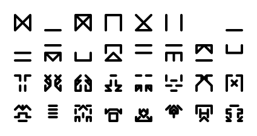

# symbolgen

[](https://circleci.com/gh/tommilligan/symbolgen)

<p align="center">
  
</p>

Generate alphabets of configurable symbols.

## Installation

Install using `cargo`:

```bash
cargo install --git https://github.com/tommilligan/symbolgen
```
